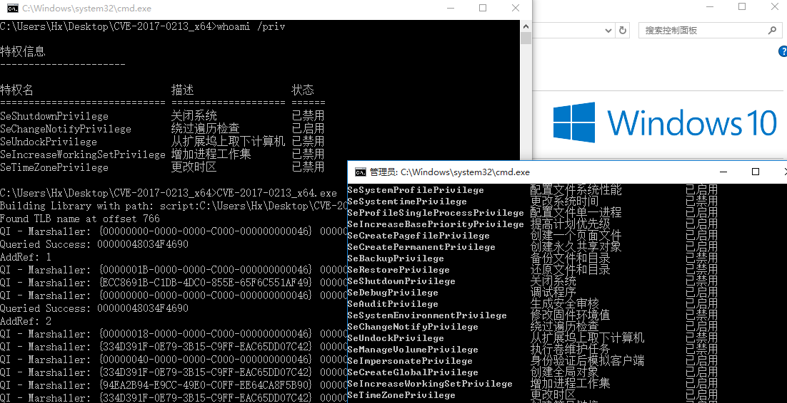

# CVE-2017-0213

Windows COM Elevation of Privilege Vulnerability  

**Description**
```
An elevation of privilege exists in Windows COM Aggregate Marshaler. 
An attacker who successfully exploited the vulnerability could run arbitrary code with elevated privileges.
To exploit the vulnerability, an attacker could run a specially crafted application that could exploit the vulnerability. 
This vulnerability by itself does not allow arbitrary code to be run. 
However, this vulnerability could be used in conjunction with one or more vulnerabilities (e.g. a remote code execution vulnerability and another elevation of privilege) that could take advantage of the elevated privileges when running.
The update addresses the vulnerability by correcting how Windows COM Marshaler processes interface requests.
```
- The exp was from [@WindowsExploits](https://github.com/WindowsExploits/Exploits/tree/master/CVE-2017-0213/Source)  

Vulnerability reference:
 * [CVE-2017-0213](https://cve.mitre.org/cgi-bin/cvename.cgi?name=CVE-2017-0213)  
 * [exp-db](https://www.exploit-db.com/exploits/42020/)


## Usage
- [YouTube-CVE 2017-0213](https://www.youtube.com/watch?v=6naFH9MQHy8)  
```
c:\> CVE-2017-0213_x64.exe
```



## References
- [Windows: COM Aggregate Marshaler/IRemUnknown2 Type Confusion EoP](https://bugs.chromium.org/p/project-zero/issues/detail?id=1107)
- [Microsoft](https://portal.msrc.microsoft.com/en-US/eula)


