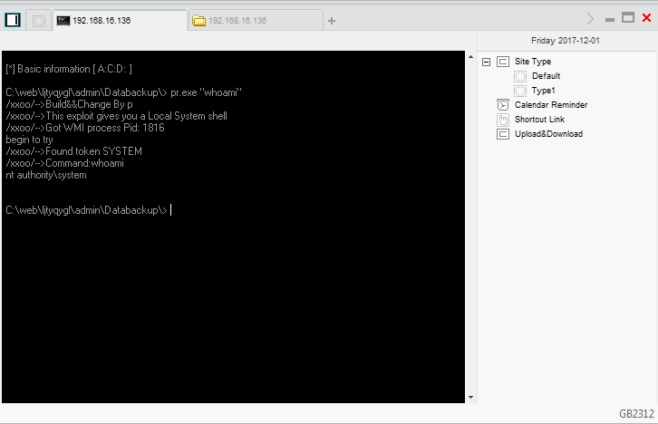
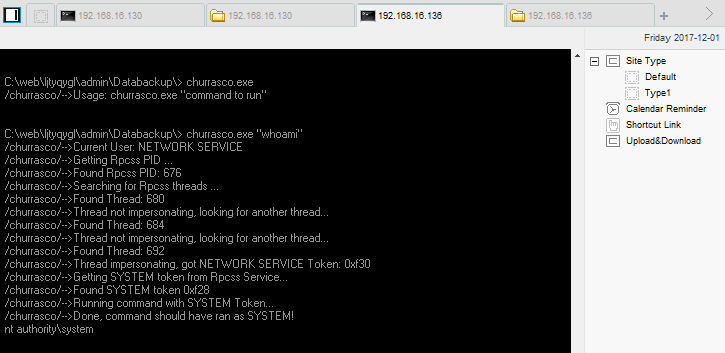

# MS09-012

MS09-012


Vulnerability reference:
 * [MS09-012](https://technet.microsoft.com/library/security/ms09-012)
 * [CVE-2009-0079](http://www.cve.mitre.org/cgi-bin/cvename.cgi?name=CVE-2009-0079)  

## Usage
```
/xxoo/-->Usage: pr.exe command
```
  


## References
[Token Kidnapping's Revenge](https://media.blackhat.com/bh-us-10/whitepapers/Cerrudo/BlackHat-USA-2010-Cerrudo-Toke-Kidnapping's-Revenge-wp.pdf)  

## Thanks
thanks for ***sam rou*** 

