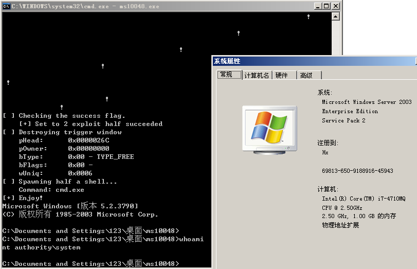

# MS10-048

```
The Windows kernel-mode drivers in win32k.sys in Microsoft Windows XP SP2 and SP3, 
Windows Server 2003 SP2, Windows Vista SP1 and SP2, Windows Server 2008 Gold, SP2, and R2, and Windows 7 do not properly validate an unspecified system-call argument, 
which allows local users to cause a denial of service (system hang) via a crafted application, 
aka "Win32k Bounds Checking Vulnerability."
```

Vulnerability reference:
 * [MS10-048](https://technet.microsoft.com/library/security/ms10-048)
 * [CVE-2010-1887](http://cve.mitre.org/cgi-bin/cvename.cgi?name=CVE-2010-1887)  
 

## Usage
```
c:\> x86.exe
```
  


## References
* [Windows x64下提权Exploit](https://www.secpulse.com/archives/1597.html) 

