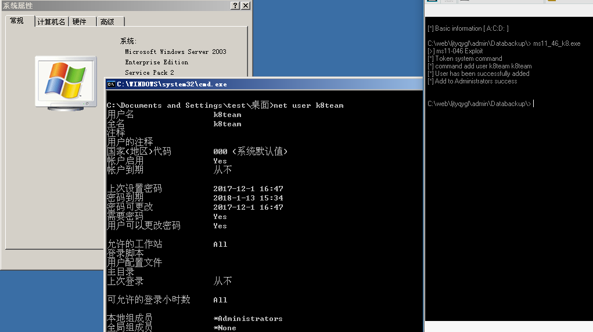
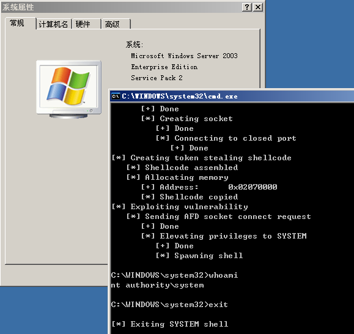

# MS11-046 

```
The Ancillary Function Driver (AFD) supports Windows sockets applications and is contained in the afd.sys file. 
The afd.sys driver runs in kernel mode and manages the Winsock TCP/IP communications protocol. An elevation of 
privilege vulnerability exists where the AFD improperly validates input passed from user mode to the kernel. 
An attacker must have valid logon credentials and be able to log on locally to exploit the vulnerability. 
An attacker who successfully exploited this vulnerability could run arbitrary code in kernel mode 
(i.e. with NT AUTHORITY\SYSTEM privileges).
```
- The exp was from [@Tomislav Paskalev](https://www.exploit-db.com/author/?a=7919)

Vulnerability reference:
 * [MS11-046](https://technet.microsoft.com/library/security/ms11-046)
 * [CVE-2011-1249](https://www.exploit-db.com/exploits/40564/)

## Usage
```
c:\\> MS11-046.exe
```
caidao

2003 local  
  
win7-x86  


