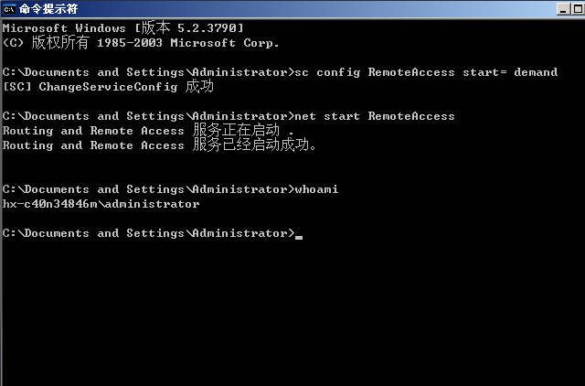
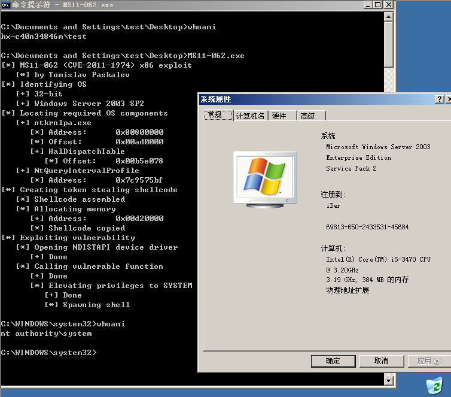

# MS11-062

```
An elevation of privilege vulnerability exists in the NDISTAPI.sys component of the
Remote Access Service NDISTAPI driver.The vulnerability is caused when the NDISTAPI 
driver improperly validates user-supplied input when passing data from user mode
to the Windows kernel. An attacker must have valid logon credentials and be able
to log on locally to exploit the vulnerability. An attacker who successfully 
exploited this vulnerability could run arbitrary code in kernel mode (i.e. with NT AUTHORITY\SYSTEM  privileges)
```
- The exp was from [@Tomislav Paskalev](https://www.exploit-db.com/author/?a=7919)

Vulnerability reference:
 * [MS11-062](https://technet.microsoft.com/library/security/ms11-062)
 * [CVE-2011-1974](https://www.exploit-db.com/exploits/40627/)

## Usage
If Admin have enable the **routing and remote access** service


c:\\> MS11-62.exe



