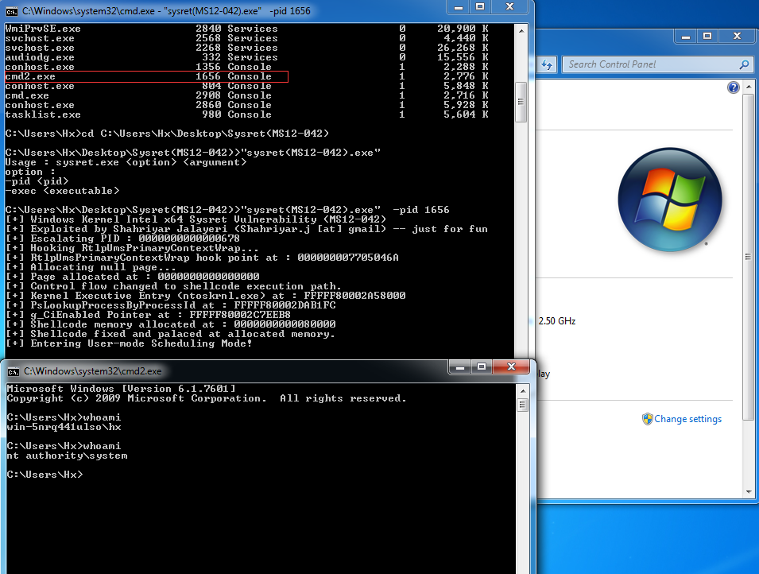

# MS12-042
```
Microsoft Service Bus 1.1 on Microsoft Windows Server 2008 R2 SP1 and Server 2012 Gold and R2 allows 
remote authenticated users to cause a denial of service (AMQP messaging outage) via crafted AMQP messages, 
aka "Service Bus Denial of Service Vulnerability."
```

Vulnerability reference:
 * [MS12-042](https://technet.microsoft.com/library/security/ms12-042)
 * [CVE-2014-2814](http://cve.mitre.org/cgi-bin/cvename.cgi?name=CVE-2014-2814)


## Usage
```
c:\> MS12-042.exe -pid xxx
```  
* [YouTube](https://www.youtube.com/watch?v=whRRFOm-DLI&feature=youtu.be)  



