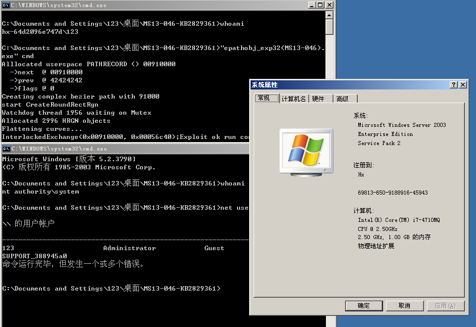
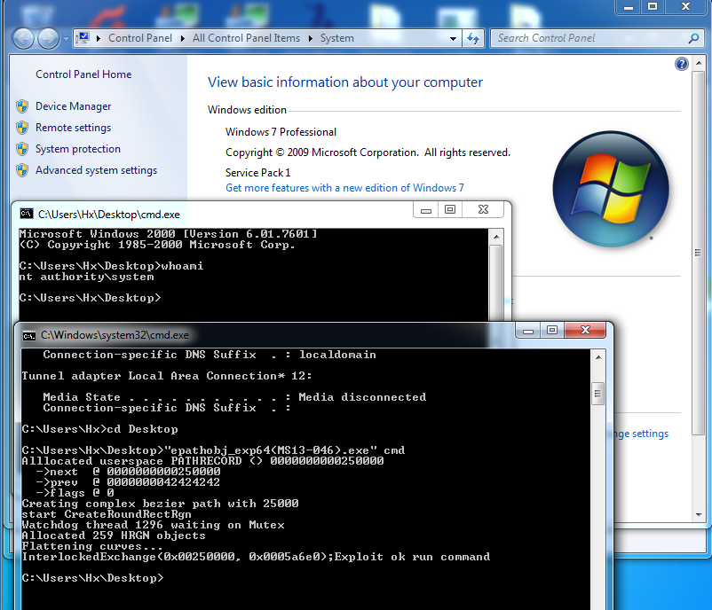

# MS13-046
```
dxgkrnl.sys (aka the DirectX graphics kernel subsystem) in the kernel-mode drivers in Microsoft Windows Vista SP2, 
Windows Server 2008 SP2 and R2 SP1, Windows 7 SP1, Windows 8, Windows Server 2012, and Windows RT does not properly handle objects in memory, 
which allows local users to gain privileges via a crafted application, aka "DirectX Graphics Kernel Subsystem Double Fetch Vulnerability."
```

Vulnerability reference:
 * [MS13-046](https://technet.microsoft.com/library/security/ms13-046)
 * [CVE-2013-1332](http://cve.mitre.org/cgi-bin/cvename.cgi?name=CVE-2013-1332)


## Usage
```
c:\> epathobj_exp32(MS13-046).exe cmd
```
  


## References 
* [打破MS13-046不能webshell执行问题](http://www.91ri.org/6708.html)  