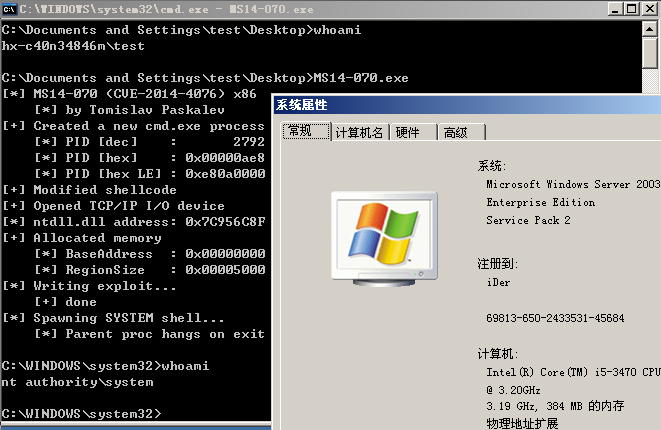

# MS14-070

- The exp was from [@dev-zzo](https://github.com/dev-zzo/exploits-nt-privesc/blob/master/MS14-070/MS14-070.c)

Vulnerability reference:
 * [MS14-070](https://technet.microsoft.com/library/security/ms14-070)
 * [CVE-2014-4076](https://www.exploit-db.com/exploits/37755/)

## Usage
c:\> MS14-070.exe

## Links

- [Microsoft Windows Server 2003 SP2 （CVE-2014-4076）](https://www.korelogic.com/Resources/Advisories/KL-001-2015-001.txt)  
