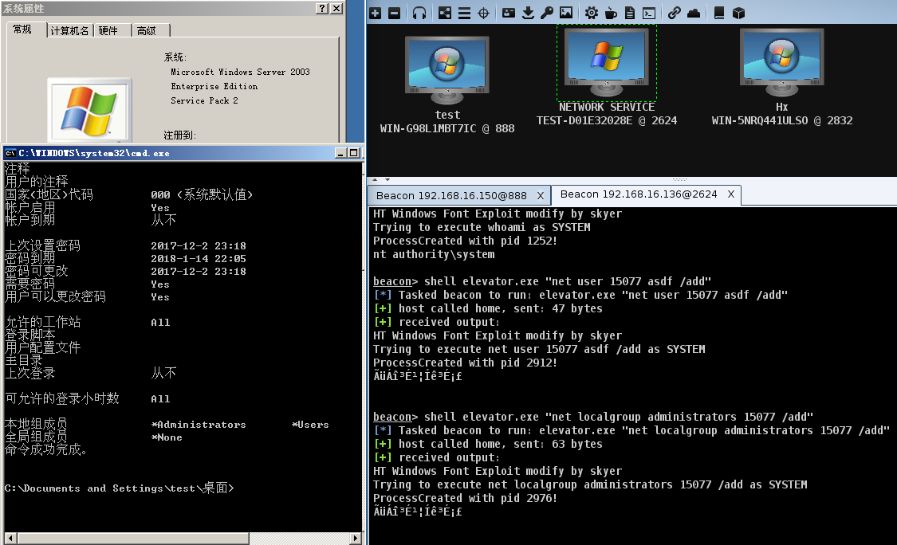
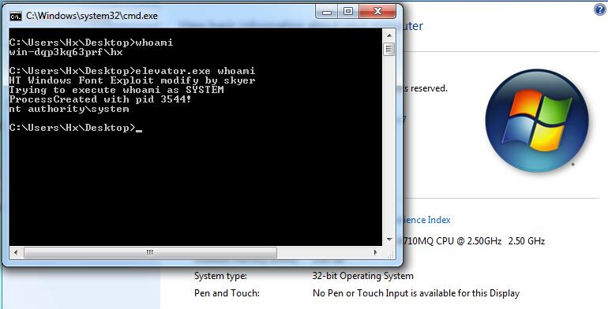
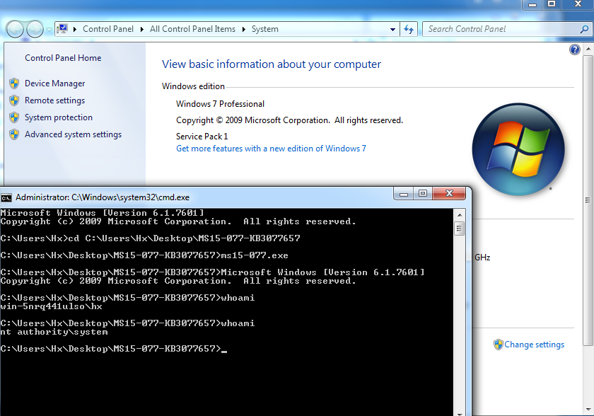

# MS15-077  

```
An elevation of privilege vulnerability exists in Adobe Type Manager Font Driver (ATMFD) when it fails to properly handle objects in memory.
An attacker who successfully exploited this vulnerability could execute arbitrary code and take complete control of an affected system. 
An attacker could then install programs; view, change, or delete data; or create new accounts with full user rights.
```

Vulnerability reference:
 * [MS15-077](https://technet.microsoft.com/zh-cn/library/security/MS15-077)  
 * [CVE-2015-2387](http://www.cve.mitre.org/cgi-bin/cvename.cgi?name=cve-2015-2387)
 * [exp-db](https://www.exploit-db.com/exploits/37098/)  

## Usage
```
c:\> elevator.exe whoami
```
  
  
    

## References
- [Exploiting_CVE_2015_2426_-_Release](https://www.google.com.hk/url?sa=t&rct=j&q=&esrc=s&source=web&cd=10&cad=rja&uact=8&ved=0ahUKEwjwupmJxrDUAhUG5mMKHcZpBw8QFghkMAk&url=https%3A%2F%2Fwww.nccgroup.trust%2Fglobalassets%2Four-research%2Fuk%2Fwhitepapers%2F2015%2F09%2F2015-08-28_-_ncc_group_-_exploiting_cve_2015_2426_-_release.pdf&usg=AFQjCNGE4OcY0-mI_8hcki768ZMYmsXTtQ)
