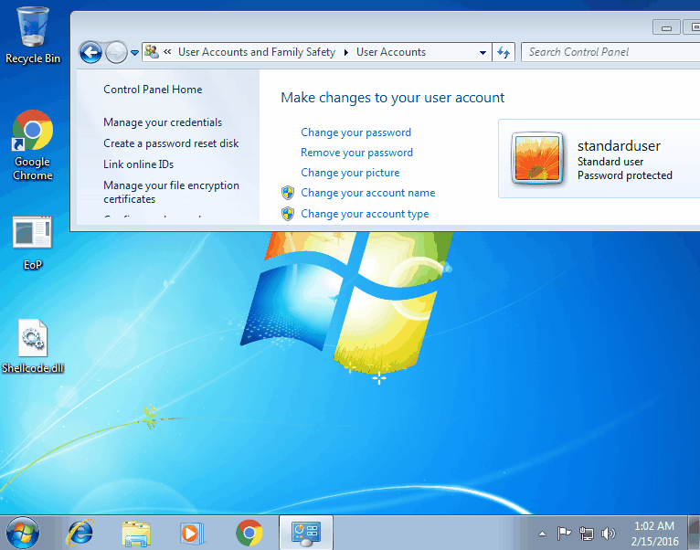

# MS16-016

- The POC of MS16-016 was from [@Tamás Koczka](https://github.com/koczkatamas/CVE-2016-0051)
- A variant of this PoC [3hexx0r](https://github.com/hexx0r/CVE-2016-0051)


Vulnerability reference:
 * [MS16-016](https://technet.microsoft.com/en-us/library/security/ms16-016.aspx)
 * [CVE-2016-0051](http://www.cve.mitre.org/cgi-bin/cvename.cgi?name=CVE-2016-0051)
 
### EoP to SYSTEM on Windows 7 SP1 x86



### BSoD on a Windows 10 x64


### msf
```
msf > use exploit/windows/local/ms16_016_webdav
```

### Links

* [Microsoft Security Bulletin MS16-016](https://technet.microsoft.com/en-us/library/security/ms16-016.aspx)
* [Microsoft Acknowledgements page](https://technet.microsoft.com/library/security/mt674627.aspx)

You can find both exploits on Exploit-db
1) koczkatamas
https://www.exploit-db.com/exploits/39432/

2) hex0r
https://www.exploit-db.com/exploits/39788/

