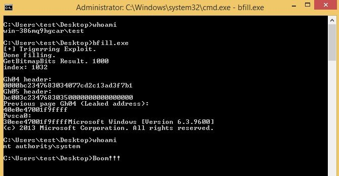

# MS16-098
- Exploiting MS16-098 RGNOBJ Integer Overflow on Windows 8.1 x64 bit by abusing GDI objects (CVE-2016-3309)
- The exp was from [@0x5A1F](https://twitter.com/Saif_Sherei)

Vulnerability reference:
 * [MS16-098](https://technet.microsoft.com/library/security/ms16-098)
 * [CVE-2016-3309](http://www.cve.mitre.org/cgi-bin/cvename.cgi?name=CVE-2016-3309)
 
## Usage

## References

* [The previously discussed MS16-098 writeup](https://sensepost.com/blog/2017/exploiting-ms16-098-rgnobj-integer-overflow-on-windows-8.1-x64-bit-by-abusing-gdi-objects/)
* [DC25 5A1F - Demystifying Windows Kernel Exploitation by Abusing GDI Objects](https://github.com/sensepost/gdi-palettes-exp)

