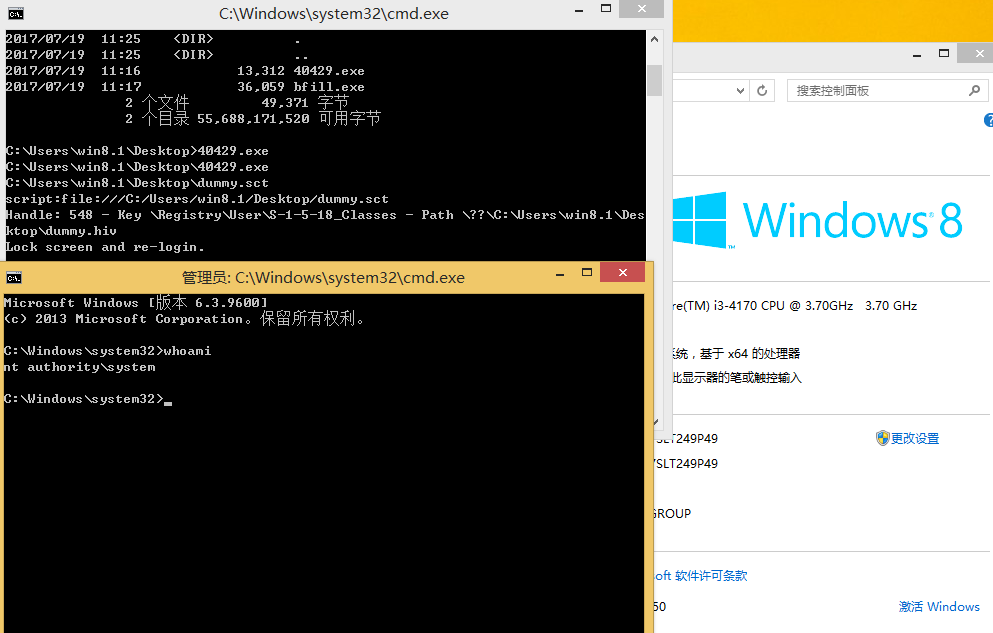
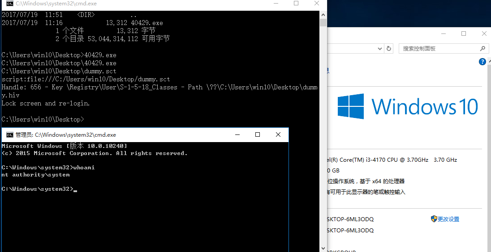

# MS16-111
```
The kernel API in Microsoft Windows Vista SP2, Windows Server 2008 SP2 and R2 SP1, 
Windows 7 SP1, Windows 8.1, Windows Server 2012 Gold and R2, Windows RT 8.1, and Windows 10 Gold, 1511, and 1607 does not properly enforce permissions, 
which allows local users to obtain sensitive information via a crafted application, aka "Windows Kernel Elevation of Privilege Vulnerability."
```  

Vulnerability reference:
 * [MS16-111](https://technet.microsoft.com/library/security/ms16-111)
 * [cve-2016-3371](http://cve.mitre.org/cgi-bin/cvename.cgi?name=cve-2016-3371)
 * [exp-db](https://www.exploit-db.com/exploits/40429/)  

## Usage
```
c:\> 40429.exe
```
* [CVE-2016-3371-YouTube](https://youtu.be/SzkbSRbxN1I)

  


### References
- [Windows: NtLoadKeyEx User Hive Attachment Point EoP](https://bugs.chromium.org/p/project-zero/issues/detail?id=865)  
