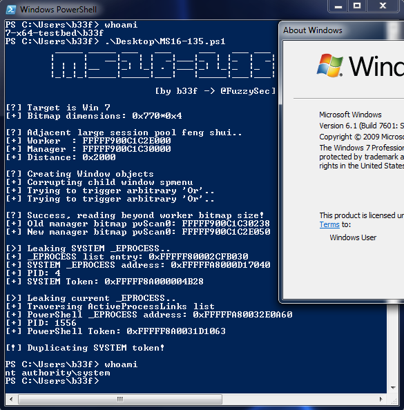
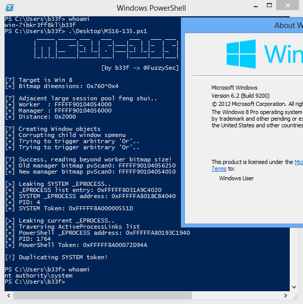
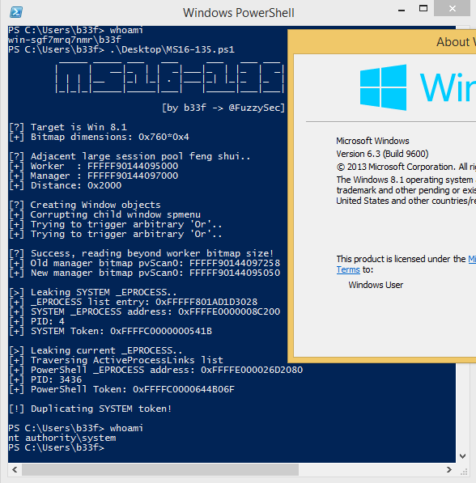
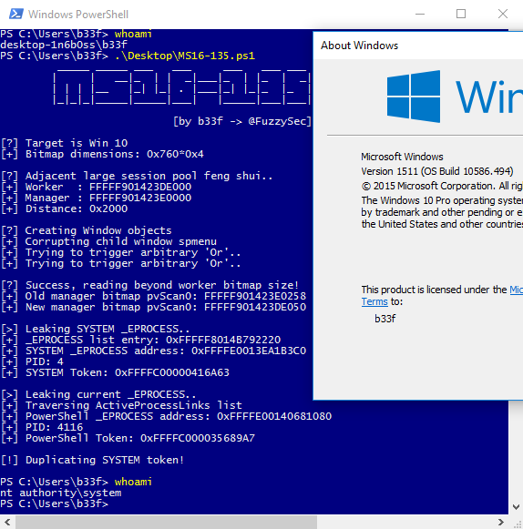

# MS16-135 x64 Universal

The POC for this bug was from [@b33f](http://www.fuzzysecurity.com/)'s post [here](https://github.com/FuzzySecurity/PSKernel-Primitives/tree/master/Sample-Exploits/MS16-135)!

Vulnerability reference:
 * [MS16-135](https://technet.microsoft.com/en-us/library/security/ms16-135.aspx)
 * [CVE-2016-7255](http://www.cve.mitre.org/cgi-bin/cvename.cgi?name=CVE-2016-7255)

## SYSTEM Shell

The exploit works on all 64-bit vulnerable targets. 

## Powershell Allowed script execution

c:\> set-ExecutionPolicy RemoteSigned

### Windows 7

### Windows 8

### Windows 8.1

### Windows 10

### References
* [MS16-135 x64 Universal](https://github.com/FuzzySecurity/PSKernel-Primitives/tree/master/Sample-Exploits/MS16-135)  
* [poc for CVE-2016-7255](https://github.com/tinysec/public/tree/master/CVE-2016-7255)  
