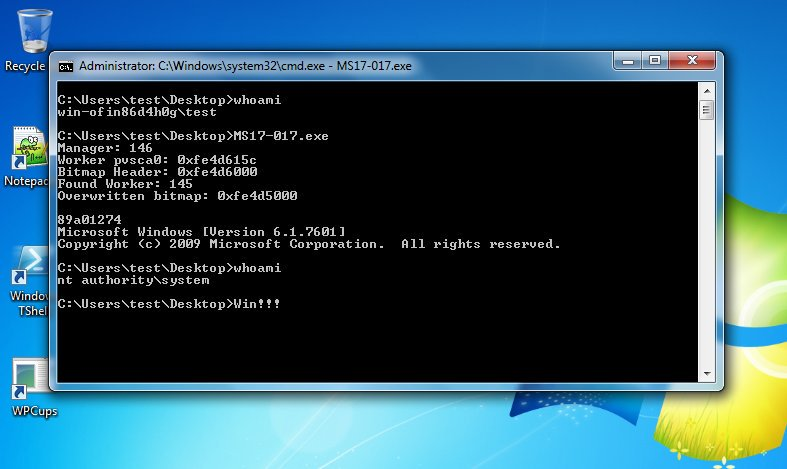

# MS17-017

This security update resolves vulnerabilities in Microsoft Windows. The vulnerabilities could allow elevation of privilege if an attacker runs a specially crafted application.

### References

* Source: https://github.com/sensepost/gdi-palettes-exp
* Binary: https://github.com/offensive-security/exploit-database-bin-sploits/raw/master/sploits/42432.exe
* https://www.exploit-db.com/exploits/42432/

